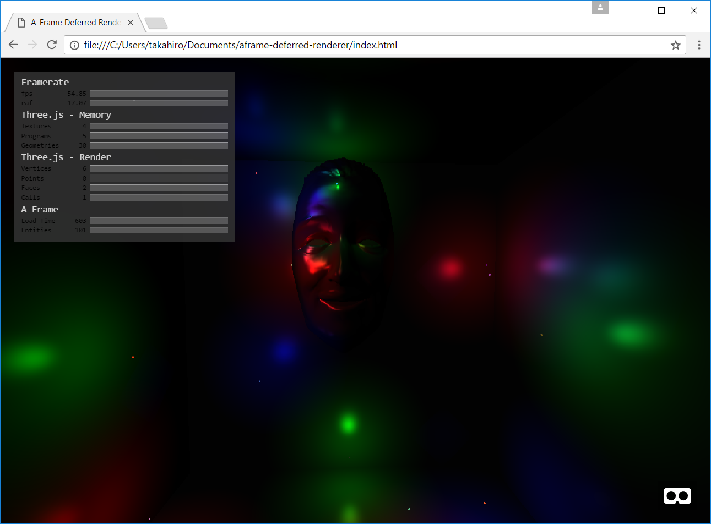

# A-Frame Deferred Renderer component

aframe-deferred-renderer is an A-Frame Deferred Renderer component.
Deferred Rendering achieves a good performance with many lights.



## Properties

### aframe-deferred-renderer

| Properties   | type    | Default Value | Description |
| ------------ | ------- | ------------- | ----------- |
| lightPrePass | boolean | true          | If true light pre-pass mode is used. Otherwise classic mode is used. |

## Browser

### How to use

```
<head>
  <script src="./libs/aframe.min.js"></script>
  <script src="./build/aframe-deferred-renderer.min.js"></script>
</head>

<body>
  <a-scene deferred-renderer>
    <a-entity position="0 10 20">
      <a-camera></a-camera>
    </a-entity>

    <a-entity geometry="primitive:sphere"></a-entity>

    <a-entity light="type:point;color:#AAA;distance:10" position="0 0 0"></a-entity>
    <a-entity light="type:point;color:#AAA;distance:10" position="10 10 10"></a-entity>
    <a-entity light="type:point;color:#AAA;distance:10" position="-10 -10 -10"></a-entity>
  </a-scene>
</body>
```

## NPM

### How to install

```
$ npm install aframe-deferred-renderer
```

### How to build

```
$ npm install
$ npm run all
```

### How to load

```
require('aframe');
require('aframe-deferred-renderer');
```
